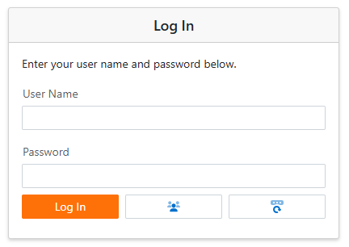

<!-- default badges list -->

[](https://supportcenter.devexpress.com/ticket/details/E4037)
[](https://docs.devexpress.com/GeneralInformation/403183)
[](#does-this-example-address-your-development-requirementsobjectives)
<!-- default badges end -->
<!-- default file list -->

# XAF Blazor UI: How to extend the logon form: register a new user, restore a password

> **Note**:
> Instead of custom implementation, we recommend that you delegate these routine tasks to OAuth2 providers. Microsoft, Google, Azure, and GitHub services enable user and document management that's familiar to anyone who works with business apps. Your XAF application can easily integrate these OAuth2 providers into the logon form. You only need to add boilerplate code.
> Refer to the following help topic for additional information: [Active Directory and OAuth2 Authentication Providers in ASP.NET Core Blazor Applications](https://docs.devexpress.com/eXpressAppFramework/402197/data-security-and-safety/security-system/authentication/oauth-and-custom-authentication/active-directory-and-oauth2-authentication-providers-in-blazor-applications).

    
This example contains a reusable [Security.Extensions](./CS/Security.Extensions/) module that implements the capability to register a new user from the login form and the "Forgot Password" feature.



The module includes the following notable building blocks:

- Non-persistent data models for parameter screens ([LogonActionParameters.cs](./CS/Security.Extensions/LogonActionParameters.cs)).
- A View Controller ([ManageUsersOnLogonController.cs](./CS/Security.Extensions/Controllers/ManageUsersOnLogonController.cs)) for the login Detail View. The controller declares custom Actions and their behavior. See the `CreateCustomLogonWindowControllers` event in [Module.cs](./CS/Security.Extensions/Module.cs#L26) to find controller registration code and other service logic.
- Services for restoring passwords ([RestorePasswordService.cs](./CS/Security.Extensions/Services/RestorePasswordService.cs)) and registering new users ([UserRegistrationService.cs](./CS/Security.Extensions/Services/UserRegistrationService.cs)).
- A custom login view for restoring a user's password (see the `Application_CreateCustomLogonAction` event handler in [Module.cs](./CS/Security.Extensions/Module.cs#L32)).

### Implementation Details

Perform the following steps to integrate this module in your project: 

1. Download the [Security.Extensions](./CS/Security.Extensions/) module project and add it to your XAF solution. Reference the module project in your Blazor project and rebuild the solution. 

    See the following topic for details: [How to: Add Projects to a Solution](https://learn.microsoft.com/en-us/previous-versions/ff460187(v=vs.140)).

2. Add the `SecurityExtensionsModule` to your application:

    _File to review:_ [DXApplication1.Blazor.Server/Startup.cs](./CS/EFCore/DXApplication1.Blazor.Server/Startup.cs#L37)

    ```cs
    public class Startup {
        public void ConfigureServices(IServiceCollection services) {
            services.AddXaf(Configuration, builder => {
                builder.Modules
                    .AddSecurityExtensions(options => options.CreateSecuritySystemUser = DXApplication1.Module.DatabaseUpdate.Updater.CreateUser)
                    // ...
                // ...
            });
            // ...
        }
        // ...
    }
    ```

    In the previous code sample, `Updater.CreateUser` is your custom method that matches the following definition:

    ```cs
    public delegate IAuthenticationStandardUser CreateSecuritySystemUser(IObjectSpace objectSpace, string userName, string email, string password, bool isAdministrator);
    ```

3. Add the `Email` property to the `ApplicationUser` class:

    _File to review:_ [ApplicationUser.cs](./CS/EFCore/DXApplication1.Module/BusinessObjects/ApplicationUser.cs)

    ```cs
    public class ApplicationUser : /*...*/ {
        // ...
        public virtual string Email { get; set; }
    }
    ```

## Files to Review

* [Updater.cs](./CS/EFCore/DXApplication1.Module/DatabaseUpdate/Updater.cs)
* [Startup.cs](./CS/EFCore/DXApplication1.Blazor.Server/Startup.cs)
* [LogonActionCustomizationController.cs](./CS/Security.Extensions/Controllers/LogonActionCustomizationController.cs)
* [ManageUsersOnLogonController.cs](./CS/Security.Extensions/Controllers/ManageUsersOnLogonController.cs)
* [RestorePasswordService.cs](./CS/Security.Extensions/Services/RestorePasswordService.cs)
* [UserRegistrationService.cs](./CS/Security.Extensions/Services/UserRegistrationService.cs)
* [ApplicationBuilderExtensions.cs](./CS/Security.Extensions/ApplicationBuilderExtensions.cs)
* [LogonActionParameters.cs](./CS/Security.Extensions/LogonActionParameters.cs)
* [Module.cs](./CS/Security.Extensions/Module.cs)

## Documentation

* [XafApplication.CreateCustomLogonWindowControllers](https://docs.devexpress.com/eXpressAppFramework/DevExpress.ExpressApp.XafApplication.CreateCustomLogonWindowControllers)
* [Authentication System Architecture (Blazor)](https://docs.devexpress.com/eXpressAppFramework/404462/data-security-and-safety/security-system/authentication/authentication-architecture-blazor)
* [Active Directory and OAuth2 Authentication Providers in ASP.NET Core Blazor Applications](https://docs.devexpress.com/eXpressAppFramework/402197/data-security-and-safety/security-system/authentication/oauth-and-custom-authentication/active-directory-and-oauth2-authentication-providers-in-blazor-applications)
* [Customize Standard Authentication Behavior and Supply Additional Logon Parameters (.NET Framework Applications)](https://docs.devexpress.com/eXpressAppFramework/112982/data-security-and-safety/security-system/authentication/customize-standard-authentication-behavior-and-supply-additional-logon-parameters/customize-authentication-behavior-net-framework)

## More Examples

* [XAF - Customize Logon Parameters](https://github.com/DevExpress-Examples/xaf-custom-logon-parameters)

<!-- feedback -->
## Does this example address your development requirements/objectives?

[](https://www.devexpress.com/support/examples/survey.xml?utm_source=github&utm_campaign=XAF_logon-form-manage-users-register-a-new-user-restore-a-password&~~~was_helpful=yes) [](https://www.devexpress.com/support/examples/survey.xml?utm_source=github&utm_campaign=XAF_logon-form-manage-users-register-a-new-user-restore-a-password&~~~was_helpful=no)

(you will be redirected to DevExpress.com to submit your response)
<!-- feedback end -->
